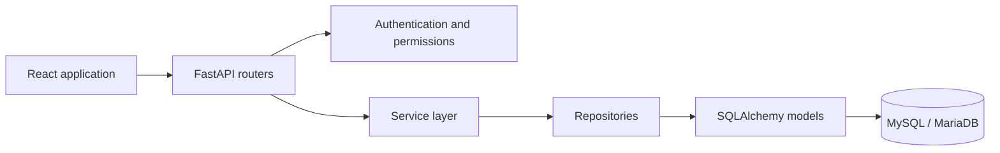

<p align="center">
  
</p>

<h1 align="center">EduCore CMS</h1>

<p align="center">
  A role-based college management platform for academics, learning, finance,
  library operations, and institutional administration.
</p>

<p align="center">
  
  
  
  
  
</p>

## Overview

EduCore CMS centralizes the operational workflows of a higher-education
institution in one web application. It combines a FastAPI backend, React
frontend, MySQL persistence, and permission-based access control.

The system models the full academic hierarchy:

```text
Department
└── Course
    └── Branch / specialization
        └── Curriculum
            └── Curriculum version
                └── Semester
                    ├── Subjects and elective groups
                    ├── Sections and students
                    └── Faculty assignments
```

Curriculum versions are locked to admission batches, sections are scoped by
course, branch, semester, and academic year, and student identifiers are
allocated through durable database-backed sequences.

## Capabilities

| Area | Included workflows |
|---|---|
| People | Student admissions, faculty profiles, departments, branches, and HOD assignment |
| Academics | Courses, curricula, curriculum versions, semesters, sections, subjects, and electives |
| Learning | Faculty allocation, attendance, marks, assignments, submissions, and timetables |
| Finance | Fee structures, student invoices, payment collection, expenses, and staff salaries |
| Library | Catalogue, authors, publishers, categories, members, issues, returns, reservations, and fines |
| Platform | CAPTCHA login, JWT cookies, RBAC, dashboards, notifications, audit logging, filtering, and exports |

## Roles and access

Authorization is enforced by the backend, not only by the interface.

| Role | Primary scope |
|---|---|
| Administrator | Institution-wide configuration and operational oversight |
| Head of Department | Branch and department academic management |
| Faculty | Teaching allocations, attendance, marks, and assignments |
| Student | Personal academics, attendance, results, fees, library, and submissions |
| Accountant | Invoices, collections, payments, expenses, and salaries |
| Librarian | Catalogue, circulation, reservations, membership, and fines |

Permissions are stored in the database and assigned through roles. Existing
administrator credentials are not overwritten during normal startup.

## Technology

### Backend

- Python and FastAPI
- SQLAlchemy ORM
- Alembic migrations
- MySQL or MariaDB through PyMySQL
- Pydantic validation and settings
- JWT authentication with HTTP-only cookies

### Frontend

- React and Vite
- React Router
- Recharts
- Lucide icons
- jsPDF and CSV export
- ESLint

### Infrastructure

- Docker Compose
- MySQL 8.4 container
- Multi-stage frontend build
- Nginx frontend container
- Persistent database and upload volumes

## Architecture



The backend separates HTTP concerns, request validation, business rules,
database access, and persistence. The frontend uses a protected application
shell, role-aware navigation, reusable resource tables, and dedicated workflow
pages.

## Repository layout

```text
EduCore/
├── backend/
│   ├── alembic/                 Database migrations
│   ├── app/
│   │   ├── core/                Shared configuration, security, and permissions
│   │   ├── database/
│   │   │   ├── base.py          Shared ORM foundation
│   │   │   ├── session.py       MySQL connection and sessions
│   │   │   └── seed.py          The only seed file; contains all demo data
│   │   ├── models/              SQLAlchemy entities
│   │   ├── repositories/        Data-access abstractions
│   │   ├── routers/             REST endpoints
│   │   ├── schemas/             Request and response contracts
│   │   └── services/            Business logic
│   ├── requirements.txt
│   └── run.py
├── docs/                         Setup, architecture, role, and presentation guides
├── frontend/
│   ├── public/
│   ├── src/
│   │   ├── components/
│   │   ├── config/
│   │   ├── pages/
│   │   └── state/
│   └── package.json
├── output/pdf/EduCore_Roles.pdf  Seven-role ownership register
└── docker-compose.yml
```

## Getting started

For the complete Windows, macOS, and Linux procedure, use
[the execution guide](docs/execution-guide.md). Database initialization differs
between new and existing installations; follow
[the database guide](docs/database-setup.md) before changing database state.

### Docker quick start

Docker Compose is the recommended way to evaluate the project consistently.

Create `backend/.env`:

Windows PowerShell:

```powershell
Copy-Item backend/.env.example backend/.env
```

macOS/Linux:

```bash
cp backend/.env.example backend/.env
```

Build and start:

```text
docker compose up -d --build
docker compose logs -f backend
```

On the first run of a new database volume, record the migration baseline after
the backend has started:

```text
docker compose exec backend python -m alembic stamp head
docker compose exec backend python -m alembic current
```

Open:

| Service | Address |
|---|---|
| Application | `http://localhost:8080` |
| Backend API | `http://localhost:8000` |
| API documentation when enabled | `http://localhost:8000/docs` |

Sign in with the administrator credentials configured in `backend/.env`.

### Native development

Native development requires Python 3.10+, Node.js 20+, and MySQL 8+ or
MariaDB 10.6+. Follow the
[native development procedure](docs/execution-guide.md#option-b-native-development)
for virtual-environment, database, backend, and frontend setup.

Development addresses:

- Frontend: `http://localhost:5173`
- Backend: `http://127.0.0.1:8000`
- API documentation: `http://127.0.0.1:8000/docs` when `DEBUG=True`

## Configuration

Copy `backend/.env.example` to `backend/.env` and review every value.

| Variable | Purpose |
|---|---|
| `DATABASE_URL` | SQLAlchemy connection URL |
| `SECRET_KEY` | JWT signing secret |
| `DEBUG` | Development mode and API documentation |
| `ADMIN_EMAIL` | Bootstrap administrator email |
| `ADMIN_USERNAME` | Bootstrap administrator username |
| `ADMIN_PASSWORD` | Bootstrap password used only when creating the first admin |
| `COOKIE_SECURE` | Restricts authentication cookies to HTTPS |
| `CORS_ORIGINS` | Allowed browser origins |
| `UPLOAD_DIR` | Persistent upload location |
| `MAIL_*` | SMTP configuration |

Percent-encode reserved characters in database credentials inside
`DATABASE_URL`. Never commit `.env`, database dumps, access tokens, or
production secrets.

## Database lifecycle

EduCore has distinct workflows for different database states:

- A new empty database is created from the current SQLAlchemy models and then
  stamped at the Alembic head.
- An existing tracked database is backed up and upgraded with Alembic.
- A restored full dump must not be initialized again before import.
- An unknown schema without `alembic_version` must be inspected rather than
  stamped blindly.

The authoritative commands, rationale, backup process, and troubleshooting
steps are in [the database guide](docs/database-setup.md).

### Demonstration data

To populate a development database with comprehensive data:

```text
cd backend
python -m app.cli seed-demo
```

The demonstration seed replaces business data while preserving system
authorization metadata and the administrator. Do not run it against valuable
institutional data.

System-only reconciliation:

```text
python -m app.cli init-db
```

Admin-preserving cleanup:

```text
python -m app.cli clean-demo
```

Cleanup is destructive. Back up the database first.

## Student identity rules

Student IDs are generated from the admission year, course code, branch code,
and a scope-specific sequence:

```text
YY + COURSE_CODE + BRANCH_CODE + sequence
```

Example:

```text
Student ID:           26BTCS001
Enrollment number:   ENR-26BTCS001
Institutional email: firstname.26btcs001@cms.edu
```

Sequence values are transactionally allocated and are not reused after a
student is deleted.

## API groups

| Prefix | Purpose |
|---|---|
| `/auth` | Login, logout, profile, and password management |
| `/api/students` | Student records and admissions |
| `/api/teachers` | Faculty records |
| `/api/departments`, `/api/courses`, `/api/subjects` | Core academic records |
| `/api/academic` | Branches, curricula, semesters, sections, electives, and allocations |
| `/api/attendance`, `/api/marks`, `/api/assignments` | Learning workflows |
| `/api/finance` | Fees, payments, expenses, and salaries |
| `/api/library` | Catalogue and circulation |
| `/api/timetables` | Timetable versions and slots |
| `/api/dashboard`, `/api/notifications` | Role-aware summaries and notifications |

Interactive endpoint documentation is available at `/docs` when `DEBUG=True`.

## Quality checks

Backend:

```text
cd backend
python -m compileall -q app
python -c "from app.main import app; print(f'{len(app.routes)} routes loaded')"
python -m alembic current
python -m alembic heads
```

The Alembic `current` and `heads` commands must report the same revision.

Frontend:

```text
cd frontend
npm run lint
npm run build
```

## Deployment

Production deployments must use:

- HTTPS and secure authentication cookies.
- Strong, externally managed secrets.
- A private, backed-up MySQL or MariaDB service.
- Restricted CORS and database network access.
- Persistent upload storage.
- A migration step before application startup.
- Monitoring and a tested rollback plan.

See [the deployment guide](docs/deployment.md) for deployment guidance and
[the database guide](docs/database-setup.md#backup-and-restore) for data migration.

## Documentation

| Document | Purpose |
|---|---|
| [Execution guide](docs/execution-guide.md) | Complete Docker and native setup |
| [Database setup](docs/database-setup.md) | Initialization, migrations, backup, restore, and troubleshooting |
| [Deployment](docs/deployment.md) | Production deployment |
| [Academic architecture](docs/academic-architecture.md) | Academic ownership and hierarchy |
| [Curriculum guide](docs/curriculum-guide.md) | Curriculum structure and behavior |
| [Role access](docs/role-access.md) | Sidebar and feature visibility by role |
| [Presentation brief](docs/presentation-brief.md) | Material for the SME presentation |
| [Role ownership PDF](output/pdf/EduCore_Roles.pdf) | Three segments, seven roles, and exhaustive file ownership |

## Security notes

- Authentication uses HTTP-only cookies.
- Backend permissions remain authoritative even when interface controls are
  hidden.
- Password hashes and initial credentials are not returned through public API
  responses.
- `COOKIE_SECURE=True` is required behind production HTTPS.
- Bootstrap credentials must be changed before the first production startup.
- Changing `ADMIN_PASSWORD` later does not reset an existing administrator.
- Demonstration seeding and cleanup are not production maintenance commands.
